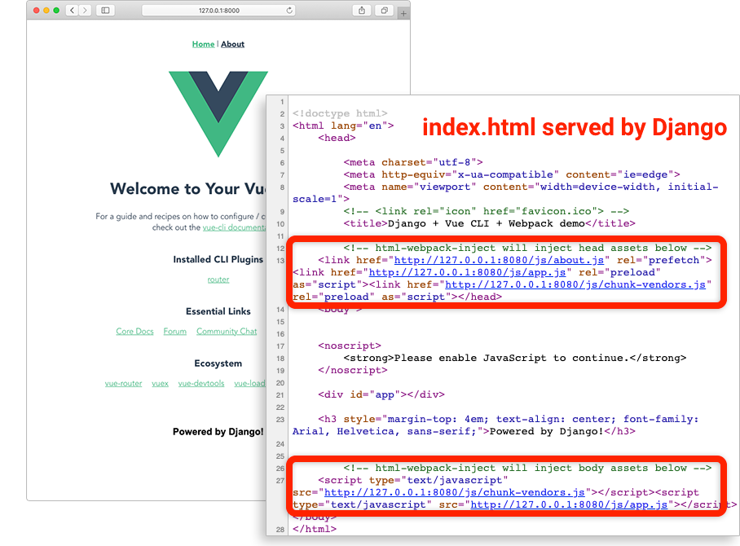

# Django + Vue CLI + Webpack demo

<a href="illustration.png"></a>

The purpose of this repository is to demonstrate a slightly more canonical (but lesser known) approach of including Webpack bundles from a Vue CLI project into Django templates **without any additional plugins**. Instead, it makes use of:

- index.html generated by html-webpack-plugin (which is bundled with Vue CLI);
- `` tag in Django templates.

**All of the Vue.js / Vue CLI / Webpack goodies — such as the dev server, client-side routing, hot module replacement, code-splitting, filename hashes, prefetch tags — should work fine in this demo. In the dev mode, the bundles are served from memory, not the disk**.

**The approach has been popularized by [@Ejez](https://github.com/ejez)**. You can read up on it [here](https://github.com/owais/django-webpack-loader/issues/209#issue-512863855), [here](https://github.com/jantimon/html-webpack-plugin/pull/1234#issuecomment-546675413) and [here](https://stackoverflow.com/questions/57394214/django-webpack-how-to-serve-generated-webpack-bundles-with-webpack-dev-server#comment103471796_58040422). The official Vue CLI documentation also gives a [hint](https://cli.vuejs.org/guide/html-and-static-assets.html#disable-index-generation) about it:

> you should consider using the indexPath option to use the generated HTML as a view template in your server-side framework

## Why not just use [django-webpack-loader](https://github.com/owais/django-webpack-loader)?

Another and more common approach (described [here](https://gist.github.com/lsapan/bdc1fbba71058cc337abc181a84b4f49) and [here](https://medium.com/js-dojo/vue-django-best-of-both-frontends-701307871478)) makes use of [django-webpack-loader](https://github.com/owais/django-webpack-loader), a Django extension which consumes output of [webpack-bundle-tracker](https://github.com/owais/webpack-bundle-tracker) (Webpack plugin from the same author, [@owais](https://github.com/owais)) and provides `` template tag.

And it’s a fine approach! If it works well for you, there is no reason to switch. But it’s good to have options to choose from, right?

## What’s inside the repository?

- `server/` — basic Django (3.0) project.
- `client/` — basic Vue CLI app generated by Vue CLI (4.3).

It’s a **minimal** working demo that you can easily run and play around with, **NOT** a starter project or boilerplate.

Additionally, there are VS Code tasks for running dev servers under `.vscode/`. If you don’t use VS Code, you don’t need this directory.

## Running

1. Clone the repo and `cd` into the directory.
2. Install Django: `pip install django`
3. Install Vue.js project dependencies: `cd client && npm install`
4. Now you can:
   - run the Vue.js dev server: `npm run serve`
   - build for production: `npm run build`
5. `cd` to the `server/` directory and run Django dev server from it: `python manage.py runserver`
6. Open `http://127.0.0.1:8000/` in your browser.

## How does this work, exactly?

A recommended way to get a quick grasp of how it all works:

1. See the changes introduced in [commit 7a3df2a](https://github.com/EugeneDae/django-vue-cli-webpack-demo/commit/7a3df2a8fe9bfa44ec4c6892cf4d8bbac903e589). The changes are minimal.
2. [Read @Ejez's short explanation](https://github.com/owais/django-webpack-loader/issues/209#issue-512863855).
3. Run the project (see instructions above).

But if you prefer reading a long text instead, have fun.

Let’s start from the [official documentation](https://cli.vuejs.org/guide/html-and-static-assets.html) for Vue CLI:

> The file public/index.html is a template that will be processed with html-webpack-plugin. During build, asset links will be injected automatically. In addition, Vue CLI also automatically injects resource hints (preload/prefetch), manifest/icon links (when PWA plugin is used), and the asset links for the JavaScript and CSS files produced during the build.

In this demo, we modified the `client/public/index.html` template so that it is also a valid Django template that extends another Django template (`server/templates/base.html`). That’s right: `client/public/index.html` is a valid template for both Vue.js and Django, but Vue.js treats it like regular HTML, ignoring Django-specific tags, like ``.

During build, Webpack of the Vue CLI app injects all necessary asset links into the template and saves the resulting file as `base-vue.html` into the Django templates directory (`server/templates/`) — as prescribed by `indexPath` option in `client/vue.config.js`:

```javascript
// outputDir resolves to server/static/dist
outputDir: '../server/static/dist',
// indexPath is relative to outputDir and resolves to server/templates/base-vue.html
indexPath: '../../templates/base-vue.html',
```

In Django’s `server/urls.py` we defined a `TemplateView` to serve `server/templates/index.html` — which is a template that extends `base-vue.html`. (Therefore, if you run the Django dev server **before** building the Vue CLI project, you will get a `TemplateDoesNotExist` error).

So the hierarchy of our Django templates can be depicted as:

```
base.html
└── base-vue.html <- generated by Webpack from client/public/index.html
    └── index.html <- served by Django at /
```

In `base-vue.html` we use the [{{ block.super }} technique](https://docs.djangoproject.com/en/dev/ref/templates/language/#template-inheritance) to preserve the contents of `<head>` and `<body>` tags from `base.html`. In a similar fashion you can customize the contents of these tags in children templates.

Worth noting that _by default_ the Vue.js dev server does not write any files to the disk, instead it serves everything from memory. However, we need `base-vue.html` on the disk, because we configured Django to use it as a template. This can be easily achieved using the Webpack’s [devServer.writeToDisk](https://webpack.js.org/configuration/dev-server/#devserverwritetodisk-) option. In `client/vue.config.js` we defined an arrow function for `devServer.writeToDisk` that tells Webpack to write only `index.html` and keep everything else in memory:

```javascript
chainWebpack: (config) => {
  config.devServer.writeToDisk((filePath) => filePath.endsWith("index.html"));
};
```

## [How to use the demo for more than one template (multipage app / MPA)?](README-MPA.md)

## Suggestions, questions?

Just [open an issue](https://github.com/EugeneDae/django-vue-cli-webpack-demo/issues). Please note that issues unrelated to the purpose of this repository will be marked as closed.
